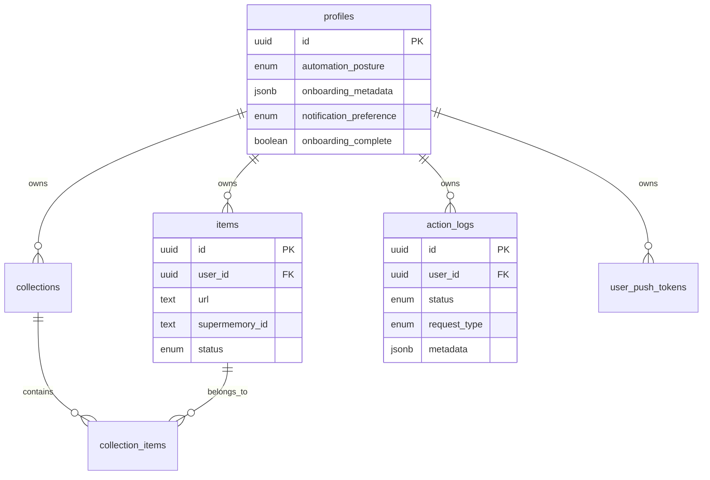

Echo uses PostgreSQL with Drizzle ORM for type-safe database operations. All tables include Row Level Security (RLS) policies to ensure data isolation.

## Database Technology

- **Database:** PostgreSQL 15+ (via Supabase)
- **ORM:** Drizzle ORM
- **Migrations:** Drizzle Kit
- **Configuration:** `drizzle.config.ts`

```typescript drizzle.config.ts
import { defineConfig } from "drizzle-kit";

export default defineConfig({
  schema: "./src/db/schema/*.ts",
  out: "./drizzle",
  dialect: "postgresql",
  dbCredentials: {
    url: process.env.DATABASE_URL,
  },
});
```

## Database Enums

Type-safe enums for column values:

```typescript src/db/schema/schema.ts
export const actionLogStatus = pgEnum("action_log_status", [
  "pending",
  "ongoing",
  "completed",
  "failed",
  "cancelled",
]);

export const automationPosture = pgEnum("automation_posture", [
  "ask_first",
  "auto_execute",
]);

export const itemStatus = pgEnum("item_status", ["active", "archived"]);

export const notificationPreference = pgEnum("notification_preference", [
  "all",
  "urgent_only",
  "daily_digest",
  "silent",
]);

export const requestType = pgEnum("request_type", ["chat", "trigger"]);
```

## Tables

### profiles

User profiles extending Supabase's `auth.users`. Stores preferences and onboarding state.

```typescript src/db/schema/schema.ts
export const profiles = pgTable(
  "profiles",
  {
    id: uuid("id").primaryKey().notNull(),
    automationPosture: automationPosture("automation_posture"),
    onboardingMetadata: jsonb("onboarding_metadata"),
    notificationPreference: notificationPreference("notification_preference")
      .default("all")
      .notNull(),
    onboardingComplete: boolean("onboarding_complete")
      .default(false)
      .notNull(),
    createdAt: timestamp("created_at", { mode: "date" })
      .defaultNow()
      .notNull(),
    updatedAt: timestamp("updated_at", { mode: "date" })
      .defaultNow()
      .notNull(),
  }
);
```

**Columns:**

| Column | Type | Constraints | Description |
|--------|------|-------------|-------------|
| `id` | uuid | PRIMARY KEY, NOT NULL | References `auth.users(id)` |
| `automation_posture` | enum | nullable | `ask_first` or `auto_execute` |
| `onboarding_metadata` | jsonb | nullable | User persona and work location |
| `notification_preference` | enum | NOT NULL, default: `all` | Notification frequency |
| `onboarding_complete` | boolean | NOT NULL, default: `false` | Onboarding completion status |
| `created_at` | timestamp | NOT NULL | Account creation time |
| `updated_at` | timestamp | NOT NULL | Last update time |

**RLS Policies:** Users can only read/update their own profile.

---

### items

Saved items (links, notes, memories). Syncs with Supermemory for distributed memory.

```typescript src/db/schema/schema.ts
export const items = pgTable(
  "items",
  {
    id: uuid("id").defaultRandom().primaryKey().notNull(),
    userId: uuid("user_id").notNull(),
    url: text("url").notNull(),
    title: text("title"),
    note: text("note"),
    tags: text("tags").array().default(sql`'{}'::text[]`).notNull(),
    status: itemStatus("status").default("active").notNull(),
    isRead: boolean("is_read").default(false).notNull(),
    ogImage: text("og_image"),
    ogDescription: text("og_description"),
    supermemoryId: text("supermemory_id"),
    createdAt: timestamp("created_at", {
      withTimezone: true,
      mode: "date",
    }).defaultNow(),
    updatedAt: timestamp("updated_at", {
      withTimezone: true,
      mode: "date",
    })
      .defaultNow()
      .notNull(),
  },
  (table) => [
    index("idx_items_is_read").on(table.isRead),
    index("idx_items_supermemory_id").on(table.supermemoryId),
    foreignKey({
      columns: [table.userId],
      foreignColumns: [profiles.id],
      name: "items_user_id_profiles_id_fk",
    }).onDelete("cascade"),
  ]
);
```

**Columns:**

| Column | Type | Constraints | Description |
|--------|------|-------------|-------------|
| `id` | uuid | PRIMARY KEY | Unique identifier |
| `user_id` | uuid | FK → profiles.id | Owner of the item |
| `url` | text | NOT NULL | URL or content being saved |
| `title` | text | nullable | Item title |
| `note` | text | nullable | User's note |
| `tags` | text[] | NOT NULL, default: `[]` | Tags for categorization |
| `status` | enum | NOT NULL, default: `active` | `active` or `archived` |
| `is_read` | boolean | NOT NULL, default: `false` | Read status |
| `og_image` | text | nullable | Open Graph image |
| `og_description` | text | nullable | Open Graph description |
| `supermemory_id` | text | nullable | Supermemory sync ID |
| `created_at` | timestamp | NOT NULL | Creation time |
| `updated_at` | timestamp | NOT NULL | Last update |

**Indexes:**
- `idx_items_is_read` on `is_read`
- `idx_items_supermemory_id` on `supermemory_id`

**RLS Policies:** Users can only CRUD their own items.

---

### collections

User-created collections to organize items.

```typescript src/db/schema/schema.ts
export const collections = pgTable(
  "collections",
  {
    id: uuid("id").defaultRandom().primaryKey().notNull(),
    userId: uuid("user_id").notNull(),
    name: text("name").notNull(),
    createdAt: timestamp("created_at", {
      withTimezone: true,
      mode: "date",
    }).defaultNow().notNull(),
  },
  (table) => [
    foreignKey({
      columns: [table.userId],
      foreignColumns: [profiles.id],
      name: "collections_user_id_profiles_id_fk",
    }).onDelete("cascade"),
  ]
);
```

**Columns:**

| Column | Type | Constraints | Description |
|--------|------|-------------|-------------|
| `id` | uuid | PRIMARY KEY | Unique identifier |
| `user_id` | uuid | FK → profiles.id | Owner |
| `name` | text | NOT NULL | Collection name |
| `created_at` | timestamp | NOT NULL | Creation time |

---

### collection_items

Join table linking items to collections (many-to-many).

```typescript src/db/schema/schema.ts
export const collectionItems = pgTable(
  "collection_items",
  {
    collectionId: uuid("collection_id").notNull(),
    itemId: uuid("item_id").notNull(),
  },
  (table) => [
    primaryKey({
      columns: [table.collectionId, table.itemId],
      name: "collection_items_pkey",
    }),
    foreignKey({
      columns: [table.collectionId],
      foreignColumns: [collections.id],
      name: "collection_items_collection_id_fk",
    }).onDelete("cascade"),
    foreignKey({
      columns: [table.itemId],
      foreignColumns: [items.id],
      name: "collection_items_item_id_fk",
    }).onDelete("cascade"),
  ]
);
```

**Composite Primary Key:** (`collection_id`, `item_id`)

**Cascade:** Deleting a collection or item removes all associated join records.

---

### action_logs

Audit trail of all AI-executed actions. Provides transparency and debugging.

```typescript src/db/schema/schema.ts
export const actionLogs = pgTable(
  "action_logs",
  {
    id: uuid("id").defaultRandom().primaryKey().notNull(),
    userId: uuid("user_id").notNull(),
    request: text("request"),
    requestType: requestType("request_type").notNull(),
    triggerSource: text("trigger_source"),
    actionName: text("action_name").notNull(),
    executionId: text("execution_id"),
    status: actionLogStatus("status").default("pending").notNull(),
    metadata: jsonb("metadata").$type<{
      actionParams?: Record<string, unknown>;
      result?: unknown;
      error?: {
        message?: string;
        code?: string;
        details?: Record<string, unknown>;
      };
      agentReasoning?: Record<string, unknown>;
      sessionId?: string;
      proposedAction?: string;
      conversationHistory?: Array<{
        role: "user" | "assistant";
        content: string;
        executionTrace?: {...};
      }>;
      composioLogId?: string;
      eventTimestamp?: string;
    }>(),
    toolkitsUsed: text("toolkits_used").array().default(sql`'{}'::text[]`).notNull(),
    additionalContext: text("additional_context"),
    createdAt: timestamp("created_at", { mode: "date" })
      .defaultNow()
      .notNull(),
    updatedAt: timestamp("updated_at", { mode: "date" })
      .defaultNow()
      .notNull(),
  },
  (table) => [
    index("user_logs_idx").on(
      table.userId,
      table.status,
      table.createdAt.desc()
    ),
    foreignKey({
      columns: [table.userId],
      foreignColumns: [profiles.id],
      name: "action_logs_user_id_profiles_id_fk",
    }).onDelete("cascade"),
  ]
);
```

**Columns:**

| Column | Type | Constraints | Description |
|--------|------|-------------|-------------|
| `id` | uuid | PRIMARY KEY | Unique identifier |
| `user_id` | uuid | FK → profiles.id | User who triggered action |
| `request_type` | enum | NOT NULL | `chat` or `trigger` |
| `trigger_source` | text | nullable | Source (e.g., 'gmail', 'calendar') |
| `action_name` | text | NOT NULL | Composio action name |
| `execution_id` | text | nullable | Composio execution ID |
| `toolkits_used` | text[] | NOT NULL, default: `[]` | Toolkit slugs used |
| `request` | text | nullable | Original user request |
| `status` | enum | NOT NULL, default: `pending` | Execution status |
| `metadata` | jsonb | nullable | Rich metadata (params, results, errors, conversation) |
| `additional_context` | text | nullable | Extra context |
| `created_at` | timestamp | NOT NULL | Creation time |
| `updated_at` | timestamp | NOT NULL | Last update |

**Indexes:**
- `user_logs_idx` composite on (`user_id`, `status`, `created_at DESC`)

**Metadata Structure:**
- `actionParams`: Parameters sent to the action
- `error`: Error details if failed
- `conversationHistory`: Multi-turn conversation with execution traces
- `sessionId`: Composio session for continuing conversations
- `proposedAction`: AI summary for notifications

---

### user_push_tokens

Device push notification tokens for Expo.

```typescript src/db/schema/schema.ts
export const userPushTokens = pgTable(
  "user_push_tokens",
  {
    id: uuid("id").defaultRandom().primaryKey().notNull(),
    userId: uuid("user_id").notNull(),
    expoPushToken: text("expo_push_token").notNull(),
    platform: text("platform"),
    deviceId: text("device_id"),
    lastSeenAt: timestamp("last_seen_at", { mode: "date" })
      .defaultNow()
      .notNull(),
    createdAt: timestamp("created_at", { mode: "date" })
      .defaultNow()
      .notNull(),
    updatedAt: timestamp("updated_at", { mode: "date" })
      .defaultNow()
      .notNull(),
  },
  (table) => [
    uniqueIndex("user_push_tokens_token_uq").on(table.expoPushToken),
    index("user_push_tokens_user_idx").on(table.userId),
    foreignKey({
      columns: [table.userId],
      foreignColumns: [profiles.id],
      name: "user_push_tokens_user_id_profiles_id_fk",
    }).onDelete("cascade"),
  ]
);
```

**Columns:**

| Column | Type | Constraints | Description |
|--------|------|-------------|-------------|
| `id` | uuid | PRIMARY KEY | Unique identifier |
| `user_id` | uuid | FK → profiles.id | Device owner |
| `expo_push_token` | text | NOT NULL, UNIQUE | Expo token |
| `platform` | text | nullable | 'ios', 'android', 'web' |
| `device_id` | text | nullable | Device identifier |
| `last_seen_at` | timestamp | NOT NULL | Last activity |
| `created_at` | timestamp | NOT NULL | Registration time |
| `updated_at` | timestamp | NOT NULL | Last update |

---

## Relationships



## Row Level Security (RLS)

All tables enforce data isolation through RLS policies:

### Items Example

```sql
-- Users can view own items
CREATE POLICY "Users can view own items"
ON items
FOR SELECT
USING (auth.uid() = user_id);

-- Users can insert own items
CREATE POLICY "Users can insert own items"
ON items
FOR INSERT
WITH CHECK (auth.uid() = user_id);

-- Users can update own items
CREATE POLICY "Users can update own items"
ON items
FOR UPDATE
USING (auth.uid() = user_id);

-- Users can delete own items
CREATE POLICY "Users can delete own items"
ON items
FOR DELETE
USING (auth.uid() = user_id);
```

<Info>
  RLS policies are defined in `src/db/schema/schema.ts` using Drizzle's `pgPolicy` helper.
</Info>

## Querying with Drizzle

### Database Connection

```typescript src/db/index.ts
import postgres from "postgres";
import { drizzle } from "drizzle-orm/postgres-js";

const connectionString = process.env.DATABASE_URL;

export const client = postgres(connectionString, {
  max: 10,
  idle_timeout: 20,
  connect_timeout: 30,
  prepare: false,
});

export const db = drizzle(client);
```

### Example Queries

```typescript
import { db } from "./db/index.js";
import { items, profiles } from "./db/schema/schema.js";
import { eq, and } from "drizzle-orm";

// Get user's active items
const activeItems = await db.query.items.findMany({
  where: and(
    eq(items.userId, userId),
    eq(items.status, "active")
  ),
  orderBy: (items, { desc }) => [desc(items.createdAt)],
});

// Create new item
const [newItem] = await db.insert(items).values({
  userId,
  url: "https://example.com",
  title: "Example",
  tags: ["learning"],
}).returning();

// Update item
await db.update(items)
  .set({ isRead: true })
  .where(eq(items.id, itemId));
```

## Migrations

### Generate Migration

After modifying `src/db/schema/schema.ts`:

```bash
pnpm db:generate
```

This creates a new migration file in `drizzle/`.

### Apply Migration

```bash
# Development (push directly)
pnpm db:push

# Production (use migration files)
pnpm db:migrate
```

<Warning>
  Use `db:push` only in development. For production, use `db:migrate` to apply versioned migrations.
</Warning>

## Next Steps

<CardGroup cols={2}>
  <Card title="Authentication" icon="lock" href="/backend/authentication">
    Learn how RLS integrates with Supabase Auth
  </Card>
  <Card title="Integrations" icon="puzzle-piece" href="/backend/integrations">
    Explore Supermemory and Composio integrations
  </Card>
</CardGroup>